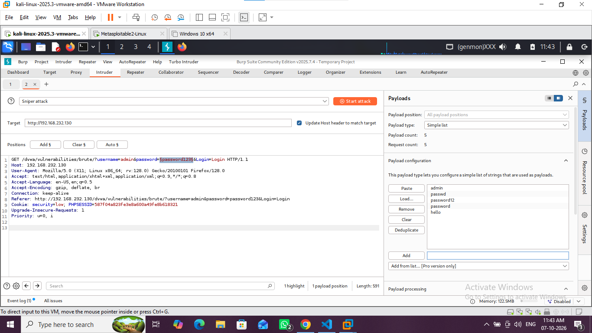
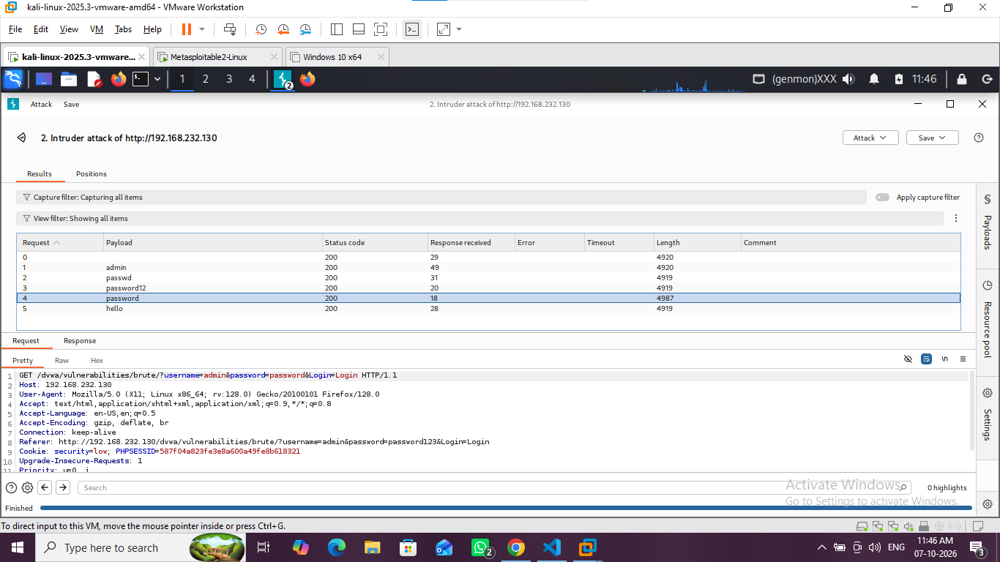
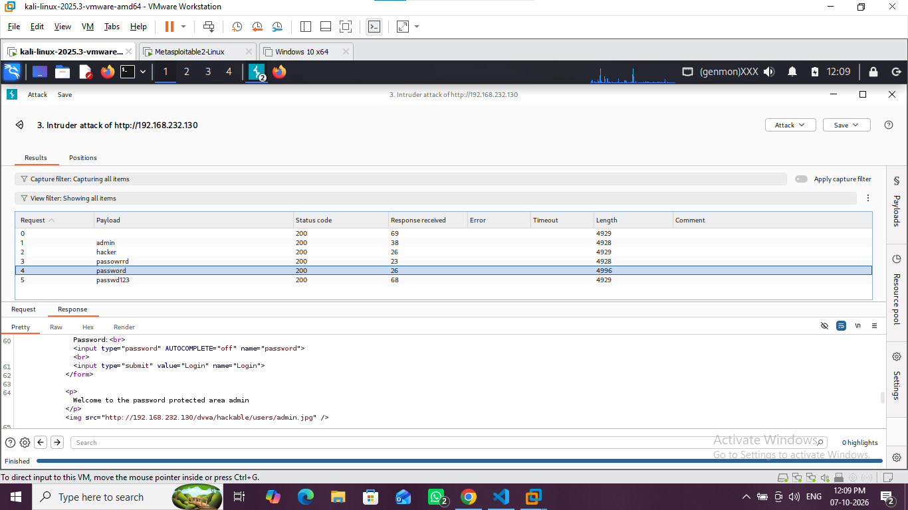
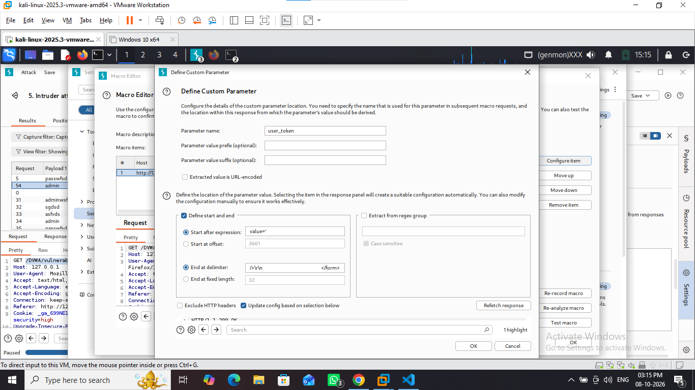
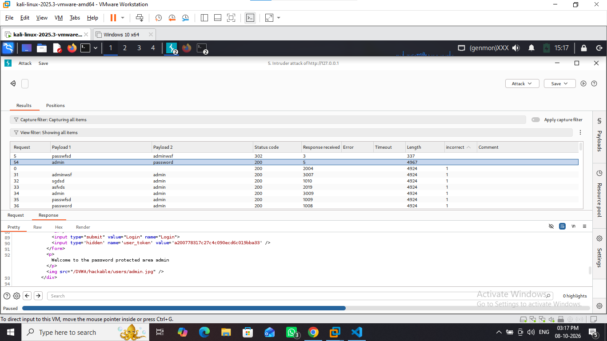

# Vulnerability Report: Brute Force Authentication (CWE-307)

### 📊 Laboratory Overview
* **Vulnerability Type:** Improper Restriction of Excessive Authentication Attempts (CWE-307)
* **Severity Rating:** 🔴 High (CVSS v3.1 Score: 8.7)
* **Target Endpoint URL:** `http://127.0.0.1//DVWA/vulnerabilities/brute/`
* **Core Tooling:** Burp Suite Professional / Community Edition (Intruder)

---

### 1. Simple Description
A brute force attack occurs when an attacker uses an automated software script to guess usernames and passwords repeatedly until the correct combination is discovered. This happens because the application lacks basic validation boundaries like account locking rules, request rate-limiting, or human bot validation challenges (CAPTCHAs).

---

### 2. Multi-Level Exploitation Walkthrough

#### 🔓 Low Security Level
* **The Defense:** The application features absolute zero defense. The backend accepts whatever login strings are typed and instantly checks them against the database.
* **The Attack Method:** 
  1. I typed a dummy login request inside my Firefox browser and intercepted the network traffic using **Burp Proxy**.
  2. I sent the web request parameters directly to **Burp Intruder** using the **Sniper** attack type.
  3. I set the attack payload marker position explicitly around the password field: `password=§password123§`.
  4. I loaded a text dictionary wordlist of common administrative login passwords and launched the automated attack.
* **The Proof of Success:** When looking at the Burp attack results window, every single incorrect password guess returned a standard response character size length. The valid combination (`admin` / `password`) immediately triggered a completely unique response length size.
* **Evidence Visual Anchors:**
  
  

#### ⚠️ Medium Security Level
* **The Defense:** The developer attempted to block automated scanners by adding a `sleep(2);` command into the application code logic. This forces the server to pause for two seconds on every single login attempt.
* **The Attack Method:** The payload strings did not need any modifications. However, running a standard single-thread attack would take way too long to finish. To bypass the slow response delay, I left the attack running on Burp Suite's default resource pool configuration. 
* **The Proof of Success:** By sending **10 concurrent login requests simultaneously in parallel threads**, the artificial 2-second sleep timers triggered at the exact same moment. This allowed me to break through the time barrier cleanly and extract the correct admin credentials without connection dropouts.
* **Evidence Visual Anchors:**
  

#### 🔒 High Security Level (DVWA v1.10+)
* **The Defense:** The application embeds a shifting cryptographic token variable named `user_token` hidden inside the login form HTML code. Every single time the login page reloads, a brand new token is generated. If a tool tries to guess a password using an old token, the server rejects it instantly.
* **The Attack Method:** 
  1. I sent a fresh request to **Burp Intruder** and switched the attack type model to **Pitchfork** mode to target two positions simultaneously: the password and the token code string.
  2. I navigated to **Intruder -> Settings -> Grep - Extract** and configured a custom rule tracking target string patterns matching `name='user_token' value='(...)`. This trained Burp to parse incoming HTML codes dynamically.
  3. In the Payloads tab, I assigned Set 1 to my password wordlist. I assigned Set 2 to the **Recursive Grep** option, which instructs Burp to automatically grab the fresh token from the previous page response and paste it into the next attempt.
  4. I created a custom Resource Pool and restricted it strictly to **1 maximum concurrent request thread**. This was mandatory to ensure that the token generation order never fell out of alignment.
* **The Proof of Success:** The attack executed line-by-line sequentially, passing the token firewall check. Sorting the output table by length quickly exposed the active administrative login credentials.
* **Evidence Visual Anchors:**
  
  

#### 🚫 Impossible Security Level (Secure Code Analysis)
* **The Defense:** This level cannot be bypassed or hacked using automation. The developer fixed the underlying architectural issues completely by writing defensive code rules.
* **Why it cannot be hacked:**
  1. **Strict Account Lockout Matrix:** The code tracks failed login counts linked to the specific username database record. If an attacker inputs 5 consecutive incorrect passwords, the application locks that user profile completely for **15 whole minutes**. This completely stops brute force automation scripts in their tracks.
  2. **True Anti-CSRF Token Checks:** The system uses secure hashing validations on its backend server storage layer before accepting data inputs.
  3. **No Timing Information Leaks:** The app structure prevents remote timing calculations or latency testing.

---

### 3. Business & Enterprise Risk Impact
If a production environment leaves login pathways open to automated brute forcing, malicious threat actors can achieve full account takeover (ATO). This exposes corporate directories, facilitates systemic data leakage, and allows attackers to compromise administrative portals to hijack cloud infrastructure networks.

---

### 4. Simple Code Fix (Remediation Guideline)
To secure authentication endpoints, applications must employ absolute backend rate-limiting or account lockout throttling logic. Additionally, deploying visual verification validation frameworks (like Google reCAPTCHA) will cleanly distinguish human actors from malicious automation scripts.

```php
// Standard Defensive Programming Sample Logic
if (\$account_failed_attempts >= 5) {
    // Lock the database account reference record
    lock_user_account(\$target_username);
    echo "This profile has been locked for 15 minutes due to excessive login failures.";
    exit();
}
```
